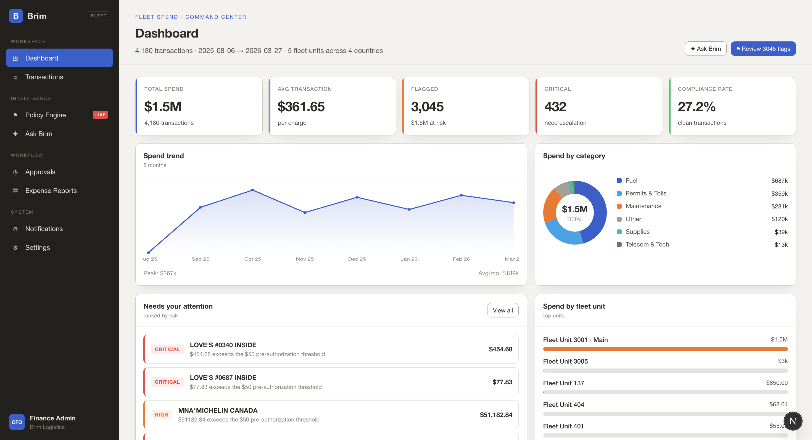
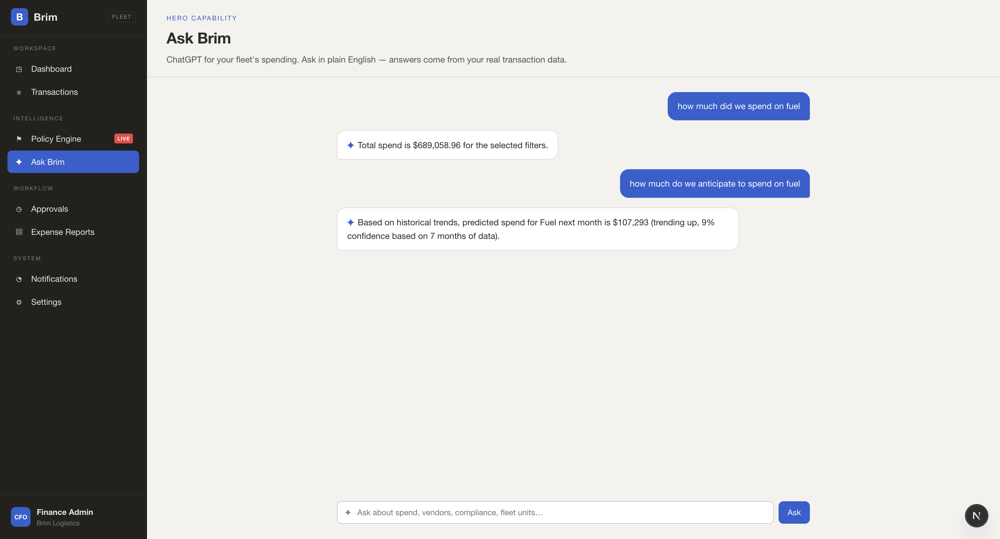
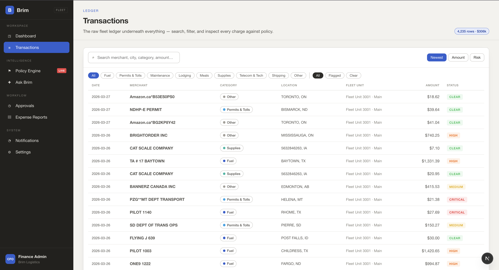
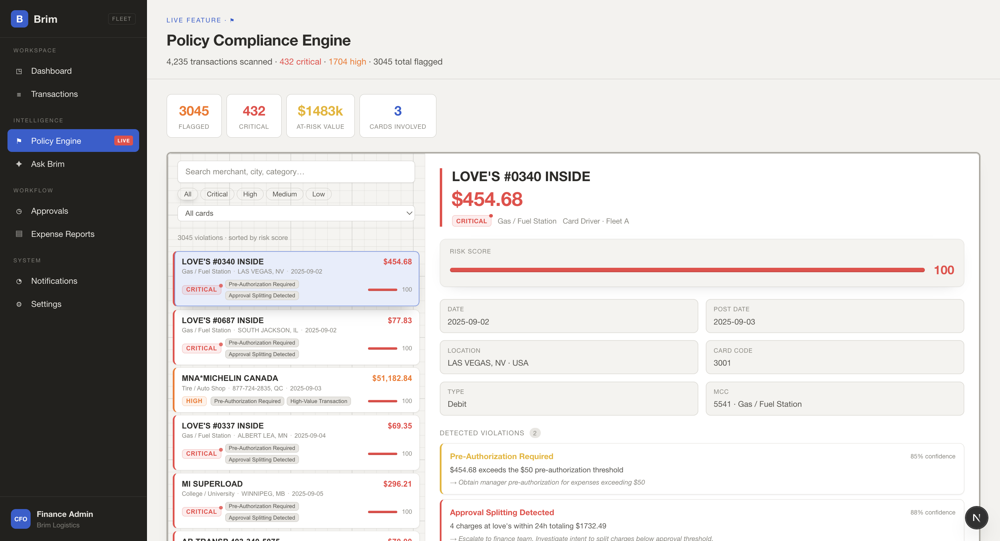
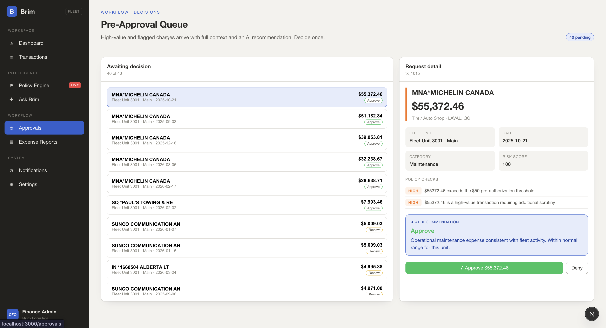
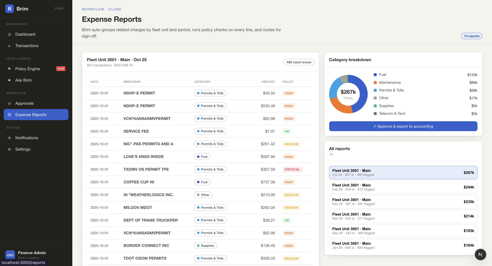
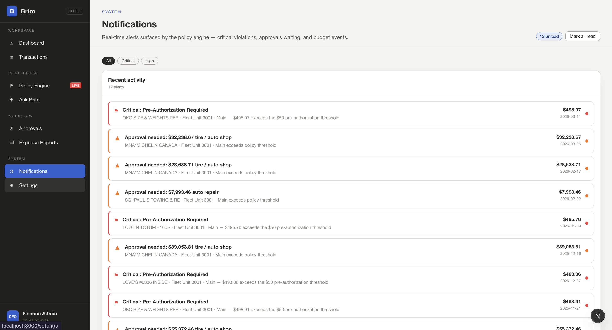
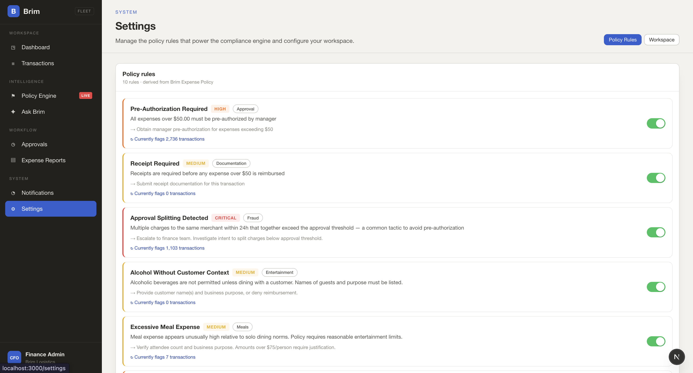

# Budge

**AI-Powered Expense Intelligence for SMB Finance Teams**

Budge is a hackathon-built finance operations platform that helps small and midsize businesses understand spend, detect policy risk, and act on approvals faster. It combines a Next.js dashboard, an Express analytics backend, Gemini-powered query understanding, rule-based compliance checks, and lightweight spending forecasts over real transaction data.

The product is designed for finance admins who need quick answers without digging through spreadsheets: ask plain-English questions, inspect the ledger, review policy flags, and approve high-risk spend from one workspace.

## Product Preview

















## What It Does

- **Ask Budge**: Natural-language finance assistant powered by Gemini and backend analytics.
- **Spend Dashboard**: KPI overview for total spend, average transaction size, flagged charges, critical risks, and compliance rate.
- **Transaction Ledger**: Search, filter, and inspect enriched expense transactions.
- **Policy Compliance Engine**: Flags risky transactions using configurable rules such as pre-authorization, split charges, high-value spend, and restricted categories.
- **Pre-Approval Queue**: Routes high-value or risky charges with AI-assisted recommendations.
- **Expense Reports**: Groups related charges by fleet unit and period for review/export workflows.
- **Notifications**: Surfaces real-time policy, approval, and budget alerts.
- **Forecasting**: Predicts future spending trends from historical transaction patterns.

## Why We Built It

SMB finance teams often rely on manual spreadsheets, delayed reports, and fragmented approvals. Budge gives them an operating layer for expense intelligence:

- Ask questions in plain English instead of building reports manually.
- Catch policy violations before they become month-end cleanup work.
- Prioritize the riskiest transactions and approvals first.
- Forecast category and department spend from historical behavior.
- Keep decision-making tied to real transaction data.

## Example Questions

```text
How much did we spend on fuel?
What did we spend on gas last month?
Show top merchants this quarter.
Which department has the most policy violations?
How much do we anticipate spending on fuel next month?
```

The backend canonicalizes common finance terms before filtering. For example, `gas`, `gasoline`, `diesel`, and `petrol` map to `Fuel`; `office supplies` maps to `Equipment` when the dataset does not contain a literal `Office Supplies` category.

## Architecture

```text
client/                  Next.js frontend
  app/                   App routes and API proxy routes
  components/            Product screens and UI components
  lib/                   Frontend analytics and policy helpers

server/                  Express backend
  routes/                API routes for ask, compliance, approvals, ML
  services/              Gemini, analytics, policy, approval, storage logic
  data/                  Enriched transactions and generated app data
  scripts/               Transaction parse/enrichment pipeline
```

## Tech Stack

- **Frontend**: Next.js, React, TypeScript, Tailwind CSS, Radix UI, Lucide icons
- **Backend**: Node.js, Express
- **AI**: Gemini API for query understanding, follow-up resolution, and summaries
- **Analytics**: Custom JavaScript services over `transactions_enriched.json`
- **ML/Forecasting**: Lightweight spending prediction utilities with `simple-statistics`
- **Data Processing**: XLSX parsing and enrichment scripts

## Key Backend Endpoints

```text
GET  /health
POST /api/ask
POST /api/compliance/scan
GET  /api/violations
PATCH /api/violations/:id/status
POST /api/approvals/generate
GET  /api/approvals
POST /api/approvals/:id/decision
POST /api/ml/sync
GET  /api/ml/insights
GET  /api/ml/predict/department/:name
GET  /api/ml/predict/employee/:id
POST /api/ml/risk-score
```

## Getting Started

### Prerequisites

- Node.js 20+
- npm
- Gemini API key

### 1. Clone and install

```bash
git clone https://github.com/faizm10/mpchacks.git
cd mpchacks

cd server
npm install

cd ../client
npm install
```

### 2. Configure environment

Create a server environment file:

```bash
cd server
touch .env
```

Add:

```env
GEMINI_API_KEY=your_gemini_api_key
GEMINI_MODEL=gemini-3.1-flash-lite
PORT=3001
```

Optional client environment:

```env
BACKEND_URL=http://localhost:3001
```

### 3. Run the backend

```bash
cd server
npm run dev
```

The API runs at:

```text
http://localhost:3001
```

### 4. Run the frontend

```bash
cd client
npm run dev
```

Open:

```text
http://localhost:3000
```

## Data Pipeline

The backend uses enriched transaction data from:

```text
server/data/transactions_enriched.json
```

If raw transaction data changes, run:

```bash
cd server
npm run parse
npm run enrich
```

Or run the full pipeline:

```bash
npm run pipeline
```

## AI Query Flow

When a user asks a question in Ask Budge:

1. The frontend sends the message to `/api/ask`.
2. Gemini converts the question into a structured query.
3. The backend canonicalizes aliases such as `gas -> Fuel`.
4. Analytics services filter `transactions_enriched.json`.
5. The backend calculates totals, chart data, table data, and follow-up suggestions.
6. Gemini summarizes the computed result in finance-friendly language.

The system avoids inventing numbers: calculations come from filtered transaction rows, not from the language model.

## Hackathon Scope

Budge is a functional prototype. It demonstrates the core workflow for AI-assisted expense intelligence, but it is not production-ready without additional security, authentication, audit logging, data permissions, and accounting-system integrations.

## Team

Built for a hackathon by the Budge team.

## License

This project was created for hackathon/demo purposes. Add a license before using it in production or distributing it publicly.
